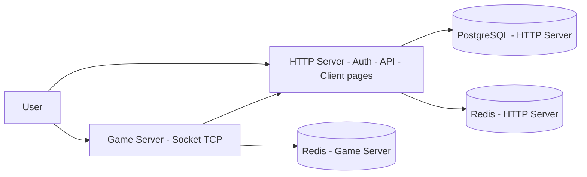

# BABVR-Infrastructure

Architecture-related stuff for Build-A-Bearville Rewritten.

This repository is the single place for everything architecture-related,
not only IaC templates. It covers the system overview,
infrastructure-as-code templates, architecture decision records (ADRs),
diagrams, and shared conventions.

## Architecture Overview

Build-A-Bearville Rewritten is composed of:

- **Backend - HTTP Server -** Nest.js + TypeScript + Node.js server.
  Responsible for auth, API, and serving the game client.
  Backed by PostgreSQL and Redis (separate from the game server's stores).
- **Backend - Game Server (`App`) -** Socket (TCP `node:net`) game server.
  Retrieves user data from the HTTP server over its API.
  Backed by its own separate Redis store, with no access
  to the HTTP server's databases or keys.
- **Cloudflare Workers KV (optional) -** Runtime metrics storage
  (e.g. `game-server:metrics`), provisioned via Terraform
  (see `templates/cloudflare/`). Not part of the core flow.

The core flow is:

1. The end user opens `{http-server-address}/login/login.html`,
   served by the HTTP server.
2. After a successful authentication, the login page redirects
   to `{http-server-address}/client.html`.
3. `client.html` verifies the session tokens from the login response,
   connects to the game server, and starts requesting user data.
4. The game server fetches the required user data
   from the HTTP server through its API.



> Supporting stores are shown without detailing their contents.
> A complete architecture diagram will follow
> once the HTTP server is complete.

## File Structure

```bash
. # Repository root
├── templates/ # Reusable IaC templates
│   └── cloudflare/ # Cloudflare provider templates (KV namespace + entries)
├── README.md # Repository README
```

Each `templates/<provider>/` folder holds a self-contained Terraform
configuration (`providers.tf`, `state.tf`, `variables.tf`,
plus one or more `<resource>.tf` files) and its own `README.md`
with deployment steps.

## Diagrams

Architecture and flow diagrams are written in
[Mermaid](https://mermaid.js.org/) and embedded directly in Markdown
so they render on GitHub without extra tooling.

## ADRs

Architecture Decision Records live alongside the code they affect
(future: `docs/adrs/`). Each ADR documents context, decision,
and consequences.

## Conventions

- Terraform templates are provider-scoped under `templates/<provider>/`.
- Never commit secrets, real account IDs, API tokens,
  bucket names, endpoints, or `*.tfstate` files.
- Backend credentials are supplied via environment variables;
  non-persisted backend arguments (e.g. `bucket`, `endpoints.s3`)
  are supplied via `terraform init -backend-config=...`.
- Terraform input variables are supplied via `TF_VAR_` environment
  variables (see each template's `README.md`).
- Environment variables are documented in a table with
  `Variable | Type | Description | Required | Default | Example`,
  following the Game Server README style.
